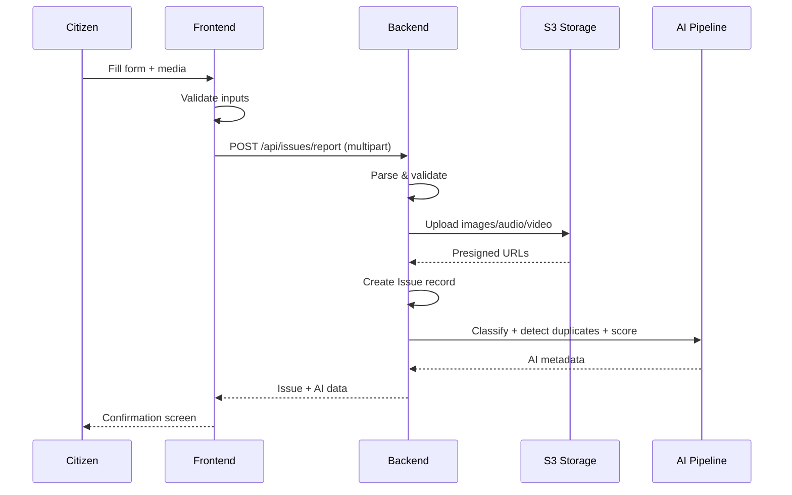

# CityPulse API Documentation

## Base URL

```
Development: http://localhost:5000
Production:  https://your-domain.com
```

## Authentication

All protected endpoints require a JWT token in the `Authorization` header:

```
Authorization: Bearer <token>
```

### Issue Reporting Flow



---

## Authentication Endpoints

### `POST /api/auth/register`

Register a new user account.

**Request Body:**
```json
{
  "firstname": "John",
  "lastname": "Doe",
  "email": "john@example.com",
  "phone": "1234567890",
  "address": "123 Main St, City",
  "password": "securepassword"
}
```

**Response (201):**
```json
{
  "message": "User registered successfully",
  "access_token": "eyJhbGci...",
  "user": {
    "id": 1,
    "firstname": "John",
    "lastname": "Doe",
    "email": "john@example.com",
    "phone": "1234567890",
    "address": "123 Main St, City",
    "role": "citizen",
    "profile_picture": "https://api.dicebear.com/..."
  }
}
```

**Errors:** `400` Missing required fields · `409` Email or phone already registered

---

### `POST /api/auth/login`

Login with email or phone number.

**Request Body:**
```json
{ "email": "john@example.com", "password": "securepassword" }
// or
{ "phone": "1234567890", "password": "securepassword" }
```

**Response (200):**
```json
{
  "message": "Login successful",
  "access_token": "eyJhbGci...",
  "user": { "id": 1, "firstname": "John", ... }
}
```

**Errors:** `400` Missing credentials · `401` Invalid credentials

---

### `POST /api/auth/logout`

**Headers:** `Authorization: Bearer <token>`

**Response (200):** `{ "message": "Logged out successfully" }`

---

### `POST /api/auth/refresh`

**Headers:** `Authorization: Bearer <refresh_token>`

**Response (200):** `{ "access_token": "eyJhbGci..." }`

---

### `GET /api/auth/me`

**Headers:** `Authorization: Bearer <token>`

**Response (200):**
```json
{
  "id": 1,
  "firstname": "John",
  "lastname": "Doe",
  "email": "john@example.com",
  "phone": "1234567890",
  "address": "123 Main St, City",
  "role": "citizen",
  "profile_picture": "https://api.dicebear.com/...",
  "created_at": "2025-01-15T10:30:00"
}
```

---

## Issue Endpoints

### `POST /api/issues/report`

Report a new issue (multipart/form-data).

**Headers:** `Authorization: Bearer <token>`

**Request Body:**

| Field | Type | Required | Description |
|-------|------|----------|-------------|
| `title` | string | Yes | Max 100 chars |
| `description` | string | Yes | Max 500 chars |
| `issue_type` | string | Yes | Pothole, Street Light, Water Supply, Sewage, Garbage, Traffic, Other |
| `latitude` | float | Yes | Location latitude |
| `longitude` | float | Yes | Location longitude |
| `address` | string | No | Street address |
| `images` | file[] | No | Up to 10 images (max 15MB each) |
| `voice_note` | file | No | Audio file |
| `video_note` | file | No | Video file |

**Response (201):**
```json
{
  "message": "Issue reported successfully",
  "issue": {
    "id": 1,
    "title": "Large pothole on Main St",
    "description": "Deep pothole near the intersection...",
    "issue_type": "Pothole",
    "status": "pending",
    "latitude": 40.7128,
    "longitude": -74.0060,
    "address": "123 Main St, New York, NY",
    "image_urls": ["https://s3...presigned-url"],
    "voice_note_url": null,
    "video_note_url": null,
    "citizen_id": 1,
    "created_at": "2025-01-15T10:30:00"
  }
}
```

**Errors:** `400` Missing required fields · `413` File too large (>15MB)

---

### `GET /api/issues`

Get all issues (authenticated).

**Headers:** `Authorization: Bearer <token>`

**Response (200):**
```json
{
  "issues": [
    {
      "id": 1,
      "title": "Large pothole on Main St",
      "description": "...",
      "issue_type": "Pothole",
      "status": "pending",
      "latitude": 40.7128,
      "longitude": -74.0060,
      "address": "123 Main St",
      "image_urls": ["..."],
      "citizen_id": 1,
      "created_at": "2025-01-15T10:30:00",
      "updated_at": "2025-01-15T10:30:00"
    }
  ]
}
```

---

### `GET /api/issues/public`

Public issues (no auth required). Limited fields — no user data, no media URLs beyond images.

**Response (200):**
```json
{
  "issues": [
    {
      "id": 1,
      "title": "Large pothole on Main St",
      "description": "...",
      "issue_type": "Pothole",
      "status": "pending",
      "latitude": 40.7128,
      "longitude": -74.0060,
      "address": "123 Main St",
      "created_at": "2025-01-15T10:30:00"
    }
  ]
}
```

---

### `GET /api/issues/my-issues`

Get current user's issues. Same response shape as `GET /api/issues` filtered to current user.

---

### `GET /api/issues/<id>`

Get single issue detail.

**Headers:** `Authorization: Bearer <token>`

**Response (200):**
```json
{
  "id": 1,
  "title": "Large pothole on Main St",
  "description": "...",
  "issue_type": "Pothole",
  "status": "in_progress",
  "latitude": 40.7128,
  "longitude": -74.0060,
  "address": "123 Main St",
  "image_urls": ["https://s3..."],
  "voice_note_url": "https://s3...",
  "video_note_url": null,
  "citizen_id": 1,
  "department_id": 2,
  "created_at": "2025-01-15T10:30:00",
  "updates": [
    {
      "id": 1,
      "title": "Investigation Started",
      "body": "Team dispatched to inspect...",
      "progress": 25,
      "image_urls": [],
      "created_at": "2025-01-16T09:00:00"
    }
  ]
}
```

---

### `PUT /api/issues/<id>`

Add images to existing issue (multipart/form-data).

| Field | Type | Required | Description |
|-------|------|----------|-------------|
| `images` | file[] | Yes | Additional images (max 15MB each) |

**Errors:** `403` Not the issue owner · `404` Issue not found

---

### `GET /api/issues/<id>/updates`

Get updates for an issue.

**Response (200):**
```json
{
  "updates": [
    {
      "id": 1,
      "title": "Investigation Started",
      "body": "Team dispatched to inspect...",
      "progress": 25,
      "image_urls": [],
      "created_at": "2025-01-16T09:00:00",
      "author": { "id": 1, "firstname": "Admin", "lastname": "User" }
    }
  ]
}
```

---

## Geocoding Endpoints

### `GET /api/geocode?q=<address>`

Geocode an address to coordinates.

| Parameter | Type | Required | Description |
|-----------|------|----------|-------------|
| `q` | string | Yes | Address to geocode |

**Response (200):**
```json
{
  "suggestions": [
    {
      "display_name": "123 Main St, New York, NY 10001, USA",
      "lat": 40.7128,
      "lon": -74.0060
    }
  ]
}
```

---

### `GET /api/reverse-geocode?lat=<lat>&lon=<lon>`

Reverse geocode coordinates to address.

| Parameter | Type | Required | Description |
|-----------|------|----------|-------------|
| `lat` | float | Yes | Latitude |
| `lon` | float | Yes | Longitude |

**Response (200):** `{ "address": "123 Main St, New York, NY 10001, USA" }`

---

## Admin Endpoints

All admin endpoints require `Authorization: Bearer <admin_token>` with `role: "admin"`.

### `GET /api/admin/users`

List all users.
```json
{ "users": [{ "id": 1, "firstname": "John", "lastname": "Doe", "email": "...", "phone": "...", "role": "citizen", "created_at": "..." }] }
```

### `DELETE /api/admin/users/<id>`

**Errors:** `404` User not found

### `GET /api/admin/issues`

List all issues (admin view with citizen and department details).

### `PUT /api/admin/issues/<id>/status`

**Request Body:** `{ "status": "in_progress" }`

Valid statuses: `pending`, `in_progress`, `resolved`, `rejected`, `verified`

### `GET /api/admin/departments`

List all departments.

### `POST /api/admin/departments`

**Request Body:**
```json
{ "name": "Public Works", "description": "Roads and infrastructure", "contact_email": "works@city.gov", "contact_phone": "555-0100" }
```

### `PUT /api/admin/issues/<id>/department`

**Request Body:** `{ "department_id": 1 }`

### `POST /api/admin/issues/<id>/updates`

Post an update (multipart/form-data).

| Field | Type | Required | Description |
|-------|------|----------|-------------|
| `title` | string | Yes | Update title |
| `body` | string | No | Update body |
| `progress` | int | No | Progress percentage (0-100) |
| `images` | file[] | No | Images for this update |

---

## Health Check

### `GET /ping`

No auth required. **Response (200):** `Pong!`

---

## Chatbot

### `POST /api/chatbot`

**Request Body:** `{ "message": "How do I report an issue?" }`

**Response (200):** `{ "response": "To report an issue..." }`

---

## AI Intelligence

When reporting an issue, the response includes:

```json
{
  "classification": {
    "issue_type": "Road Maintenance",
    "confidence": 0.85
  },
  "priority": {
    "level": "high",
    "score": 65.0,
    "breakdown": {
      "text_urgency": 30.0,
      "community_engagement": 0.0,
      "age_factor": 0.0,
      "type_severity": 12.0,
      "evidence_bonus": 10.0,
      "total": 65.0
    }
  },
  "potential_duplicates": [
    { "id": 42, "title": "Similar issue reported", "status": "pending", "similarity": 0.75 }
  ]
}
```

**Classification Categories:** Road Maintenance · Electricity · Water Supply · Waste Management · Public Transportation

**Priority Levels:** `critical` (≥70) · `high` (≥50) · `medium` (≥30) · `low` (<30)

---

## Error Response Format

All errors follow: `{ "message": "Error description" }`

| Code | Meaning |
|------|---------|
| `400` | Bad Request — Missing/invalid fields |
| `401` | Unauthorized — Invalid or missing token |
| `403` | Forbidden — Insufficient permissions |
| `404` | Not Found |
| `409` | Conflict — Duplicate resource |
| `413` | Payload Too Large |
| `500` | Internal Server Error |
