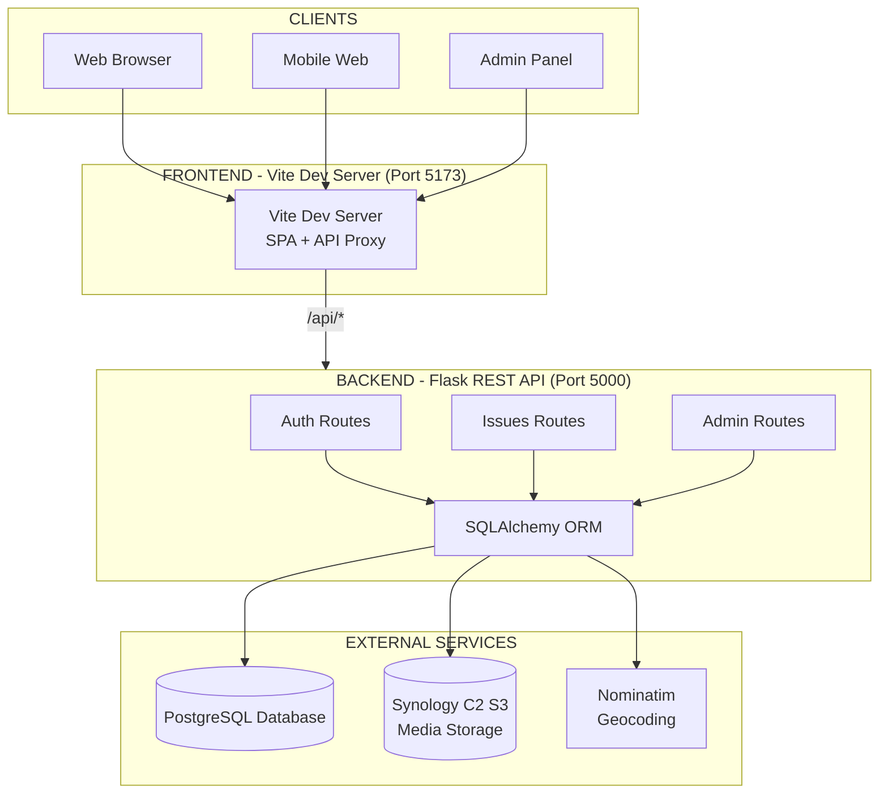
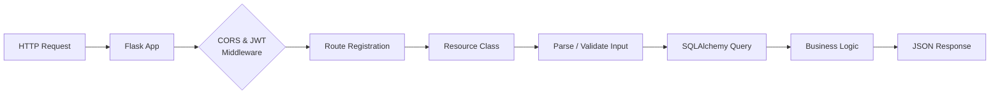
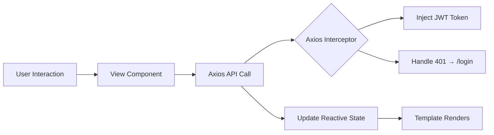
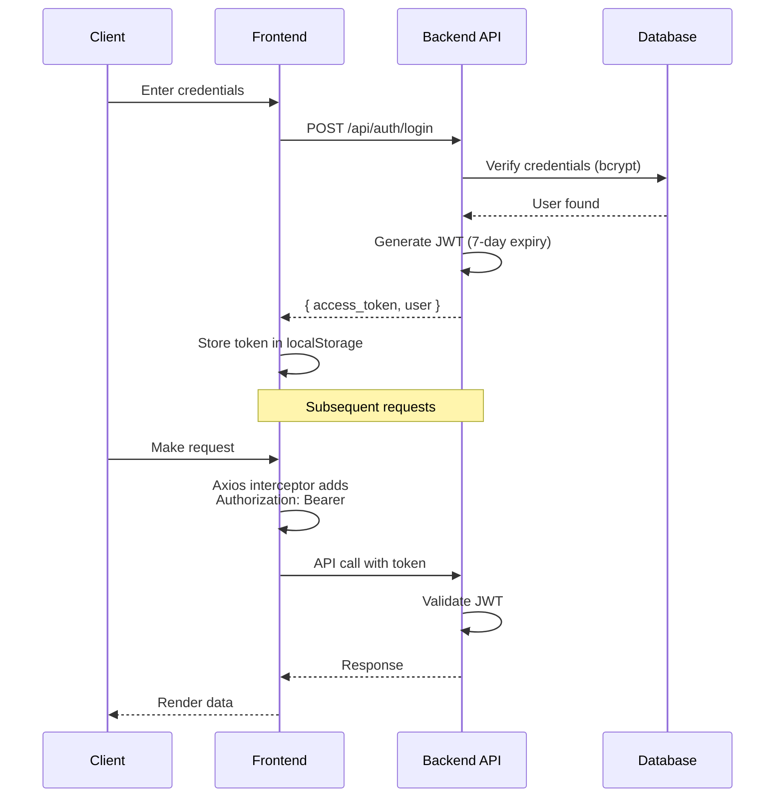
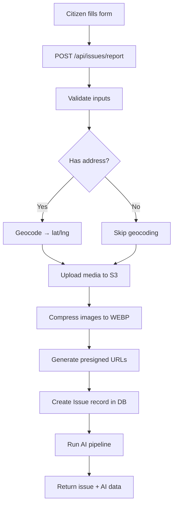
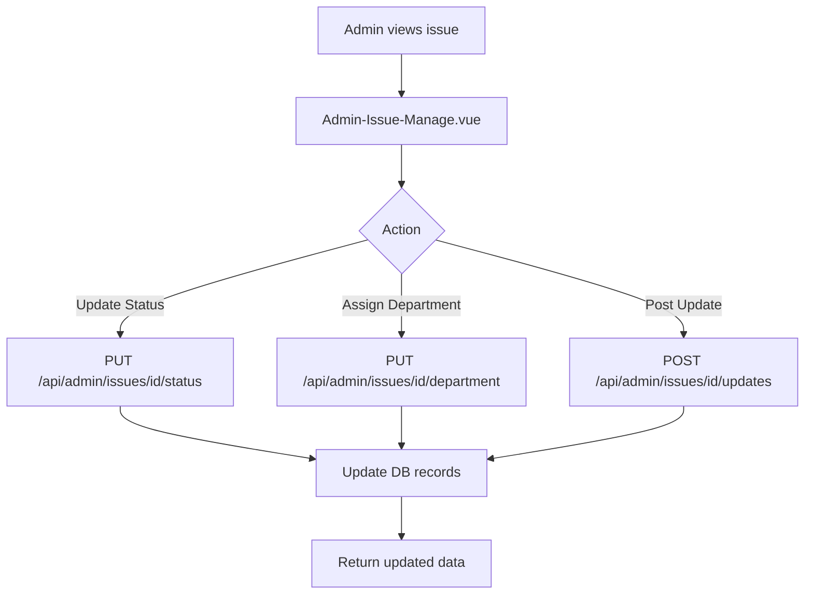

# CityPulse Architecture

## Overview

CityPulse is a **civic issue reporting and management platform** built as a monorepo with two independent applications: a Python/Flask REST API backend and a Vue 3 Single Page Application (SPA) frontend.

## High-Level Architecture



## Project Structure

```
CityPulse/
├── backend/                    # Python/Flask REST API
│   ├── api/
│   │   ├── models/             # SQLAlchemy ORM models
│   │   │   ├── user.py         # User model with roles
│   │   │   ├── issue.py        # Issue model with status tracking
│   │   │   ├── department.py   # Department model (with SLA)
│   │   │   ├── issue_update.py # Issue update/progress tracking
│   │   │   ├── verification.py # Verification status model
│   │   │   ├── upvote.py       # Citizen upvotes
│   │   │   ├── comment.py      # Issue comments
│   │   │   ├── audit_log.py    # Admin action audit trail
│   │   │   ├── geofence.py     # Geographic bounding boxes
│   │   │   └── password_reset.py # Password reset tokens
│   │   ├── routes/             # Flask-RESTful Resource classes
│   │   │   ├── auth.py         # Authentication endpoints
│   │   │   ├── issues.py       # Issue CRUD + geocoding + AI
│   │   │   ├── admin.py        # Admin management endpoints
│   │   │   ├── oauth.py        # Google/GitHub OAuth2
│   │   │   └── chatbot.py      # AI chatbot endpoint
│   │   ├── data/
│   │   │   └── departments.json # Default department seed data
│   │   └── utils/
│   │       ├── s3.py           # S3 upload + image compression
│   │       ├── email.py        # Flask-Mail notifications
│   │       ├── sms.py          # Twilio SMS notifications
│   │       ├── classifier.py   # AI issue classification
│   │       ├── duplicate_detector.py # Duplicate detection
│   │       └── priority_scorer.py   # Priority scoring
│   ├── tests/                  # pytest test suite
│   ├── app.py                  # Flask app factory + route registration
│   ├── config.py               # Configuration (DB, JWT, S3, OAuth)
│   ├── Dockerfile              # Python 3.13 + gunicorn
│   ├── pyproject.toml          # Python dependencies (uv)
│   └── .env.example            # Environment variable template
├── frontend/                   # Vue 3 SPA
│   ├── src/
│   │   ├── api/client.js       # Axios instance with interceptors
│   │   ├── components/         # Reusable UI components
│   │   ├── views/              # Page-level components
│   │   ├── router/index.js     # Vue Router with navigation guards
│   │   ├── stores/             # Pinia stores (auth, chatbot)
│   │   ├── App.vue
│   │   └── main.js
│   ├── Dockerfile              # Multi-stage Node build + nginx
│   └── nginx.conf              # Reverse proxy config
├── docker-compose.yml          # Docker Compose orchestration
├── devserver.sh                # Dev startup script (both servers)
└── .github/workflows/ci.yml    # CI/CD pipeline
```

## Backend Architecture

The backend uses a **resource-based architecture** where each API endpoint is a Flask-RESTful `Resource` class with HTTP method handlers.



### Key Patterns

| Pattern | Implementation |
|---------|---------------|
| **App Factory** | `create_app()` builds and configures Flask |
| **Resource Classes** | Each endpoint = a class with HTTP method handlers |
| **Model Layer** | SQLAlchemy ORM models with relationships |
| **Utils Layer** | S3 uploads, email, SMS, AI classification isolated in `utils/` |
| **Middleware** | JWT auth, CORS, rate limiting applied at app level |
| **AI Pipeline** | Classification → Duplicate Detection → Priority Scoring |

## Frontend Architecture

The frontend uses a **component-based architecture** with Vue 3's Composition API (`<script setup>` syntax).



### Key Patterns

| Pattern | Implementation |
|---------|---------------|
| **Composition API** | `<script setup>` for all components |
| **State Management** | Pinia store for auth state |
| **Route Guards** | Navigation guards for auth/admin checks |
| **Axios Interceptors** | Token injection + error handling |
| **Component Composition** | Views compose multiple child components |

## Authentication & Authorization

### JWT-Based Authentication Flow



### Role-Based Access Control

| Role | Permissions |
|------|-------------|
| `citizen` | Report issues, view own issues, view public issues |
| `admin` | All citizen permissions + manage users, update issue status, assign departments, post updates |

**Admin Route Protection:**
- Backend: Each admin endpoint checks `user.role != UserRole.admin` → returns 403
- Frontend: Router guard checks `authStore.user?.role !== 'admin'` → redirects to `/dashboard`

## Data Flow

### Issue Reporting Flow



### Issue Resolution Flow



## External Services

| Service | Purpose | Integration |
|---------|---------|-------------|
| **PostgreSQL** | Primary database | SQLAlchemy ORM |
| **Synology C2 S3** | Image/voice/video storage | boto3 client |
| **Nominatim** | Address geocoding | HTTP API |
| **DiceBear** | Profile picture generation | External URL |
| **Twilio** | SMS notifications | twilio Python client |
| **Flask-Mail** | Email notifications | SMTP integration |
| **Authlib** | OAuth2 (Google/GitHub) | OAuth2 client |
| **Vite** | Frontend dev/build | Dev server + API proxy |

## Security Considerations

| Area | Implementation |
|------|---------------|
| Password Storage | bcrypt hashing via passlib |
| JWT Tokens | 7-day expiry, header-based |
| CORS | Configurable via `CORS_ORIGINS` env var |
| S3 Access | Presigned URLs with 7-day expiry |
| Input Validation | Server-side via Flask-RESTful |
| SQL Injection | Prevented by SQLAlchemy ORM |
| Rate Limiting | Flask-Limiter on auth endpoints |
| OAuth2 | Authlib for Google/GitHub SSO |
