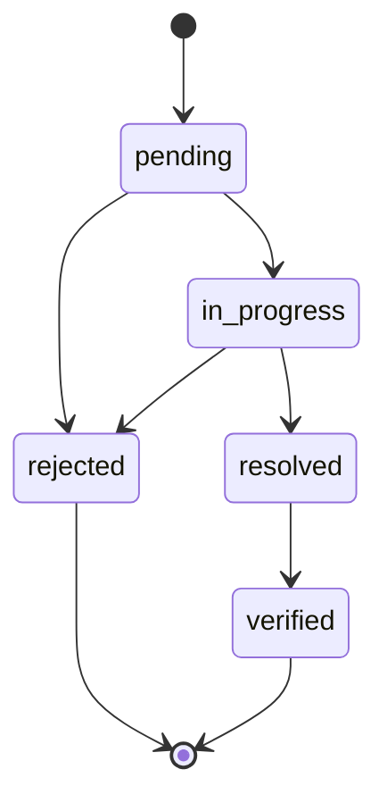
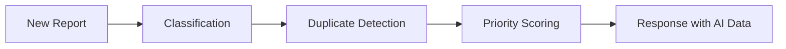

# CityPulse Features

## 1. Authentication System

| Feature | Status | Details |
|---------|--------|---------|
| User Registration | ✅ | Firstname, lastname, email, phone, address, password |
| Login (Email/Phone) | ✅ | Supports both email and phone number |
| JWT Authentication | ✅ | 7-day access tokens, header-based |
| Password Hashing | ✅ | bcrypt via passlib |
| Role-Based Access | ✅ | `citizen` and `admin` roles |
| Auto Profile Pictures | ✅ | DiceBear API avatar generation |
| Password Reset | ✅ | Email-based token reset flow |
| OAuth2 SSO | ✅ | Google and GitHub login via Authlib |

**Routes:**
`POST /api/auth/register` · `POST /api/auth/login` · `POST /api/auth/logout` · `POST /api/auth/refresh` · `GET /api/auth/me` · `PUT /api/auth/profile` · `POST /api/auth/forgot-password` · `POST /api/auth/reset-password` · `GET /api/auth/oauth/google` · `GET /api/auth/oauth/github`

---

## 2. Issue Reporting (Citizens)

| Feature | Status | Details |
|---------|--------|---------|
| Multi-Field Form | ✅ | Title, description, type, location, media |
| Image Upload | ✅ | Multi-file, max 15MB, compressed to WEBP |
| Voice Notes | ✅ | Audio recording via MediaRecorder API |
| Video Notes | ✅ | Video recording with codec fallback |
| Browser Geolocation | ✅ | One-click location from device GPS |
| Interactive Map | ✅ | Click/drag on Leaflet map to set location |
| Address Search | ✅ | Nominatim autocomplete with suggestion list |
| Reverse Geocoding | ✅ | Convert coordinates to street address |
| AI Auto-Classification | ✅ | Auto-categorize issues from text |
| Duplicate Detection | ✅ | Find similar reported issues |
| Priority Scoring | ✅ | AI-based urgency ranking |

---

## 3. Media Features

| Feature | Status | Details |
|---------|--------|---------|
| Photo Capture | ✅ | Webcam/device camera via getUserMedia |
| Audio Recording | ✅ | Microphone recording with visualization bars |
| Video Recording | ✅ | Camera recording with codec fallback |
| Image Compression | ✅ | Pillow-based, WEBP format, max 1.5MB |
| Image Lightbox | ✅ | Full-screen gallery with prev/next navigation |
| S3 Presigned URLs | ✅ | Secure temporary access to media (7-day expiry) |

---

## 4. Issue Management

| Feature | Status | Details |
|---------|--------|---------|
| View All Issues | ✅ | Authenticated users see all issues |
| View My Issues | ✅ | Filter to own reported issues |
| Issue Detail Page | ✅ | Full details, map, media, updates timeline |
| Add Images to Issue | ✅ | Upload additional images to existing issue |
| Status Tracking | ✅ | 5 states with transitions |
| Department Assignment | ✅ | Assign issues to departments |
| Progress Updates | ✅ | Admin posts updates with title, body, progress % |
| Upvoting | ✅ | Citizens can upvote issues to show priority |
| Comments | ✅ | Threaded comments on issues |
| Search & Filter | ✅ | Full-text search + filter by type, status, date |

### Issue Status Flow

---

## 5. Public Features

| Feature | Status | Details |
|---------|--------|---------|
| Landing Page | ✅ | Hero section, feature cards, CTA |
| Public Reports Feed | ✅ | Live nearby reports (limited fields) |
| Interactive Map | ✅ | Leaflet map showing public issues |
| Status-Colored Markers | ✅ | Map markers colored by issue status |

---

## 6. Admin Dashboard

| Feature | Status | Details |
|---------|--------|---------|
| Admin Stats | ✅ | Total users, issues, status breakdown |
| Interactive Map | ✅ | All issues with status-colored markers |
| Issue List | ✅ | Filterable by status, type, date |
| User Management | ✅ | View all users, delete users |
| Issue Management | ✅ | Update status, assign department |
| Department Management | ✅ | Create departments, list all |
| Issue Updates | ✅ | Post updates with progress tracking |
| Analytics Dashboard | ✅ | Chart.js doughnut/bar charts |
| CSV Export | ✅ | Export issues with filters |
| SLA Tracking | ✅ | Track resolution time vs targets |
| Geofence Management | ✅ | Auto-assign by location |
| Audit Log | ✅ | Track all admin actions |

---

## 7. AI Intelligence

| Feature | Status | Details |
|---------|--------|---------|
| Issue Classification | ✅ | Keyword-based auto-categorization |
| Duplicate Detection | ✅ | Jaccard/Cosine text similarity + location |
| Priority Scoring | ✅ | Multi-factor 0-100 scoring system |
| Chatbot | ✅ | FAQ-based issue reporting guidance |

### AI Pipeline

### Priority Scoring Factors

| Factor | Description |
|--------|-------------|
| Text urgency | Keyword analysis |
| Community engagement | Upvotes, comments |
| Issue age | Time since reported |
| Type severity | Base severity by category |
| Evidence bonus | Has images/audio/video |

**Priority Levels:**
- **Critical** (score ≥ 70)
- **High** (score ≥ 50)
- **Medium** (score ≥ 30)
- **Low** (score < 30)

---

## 8. UI/UX

| Feature | Status | Details |
|---------|--------|---------|
| Responsive Design | ✅ | Tailwind CSS responsive utilities |
| DaisyUI Components | ✅ | Modern UI component library |
| Dark Theme Ready | ✅ | DaisyUI theme support |
| Form Validation | ✅ | Client-side required fields |
| Loading States | ✅ | Visual feedback during API calls |
| Status Badges | ✅ | Color-coded issue status display |
| Navigation Guards | ✅ | Auth-based route protection |
| Auto-Redirect | ✅ | Admins → admin dashboard on login |
| Error Boundary | ✅ | Catch and display component errors |
| Skeleton Loaders | ✅ | Better UX during data fetching |
| Chatbot Widget | ✅ | Floating AI assistant on all pages |

---

## 9. Platform & DevOps

| Feature | Status | Details |
|---------|--------|---------|
| Docker Setup | ✅ | Multi-stage builds + docker-compose |
| CI/CD Pipeline | ✅ | GitHub Actions for test + build |
| Unit Tests | ✅ | 16 backend (pytest) + 6 frontend (vitest) |
| Integration Tests | ✅ | 9 full lifecycle tests |
| API Versioning | ✅ | `/api/v1/` redirects to `/api/` |
| Rate Limiting | ✅ | Flask-Limiter on auth endpoints |
| SMS Notifications | ✅ | Twilio integration (graceful fallback) |

---

## Planned Features

| Feature | Priority | Effort |
|---------|----------|--------|
| Mobile App | Medium | Very High |
| Offline Support | Low | High |
| Live Chat | Low | High |
| Multi-Language Support | Low | High |
| Image Annotations | Low | High |
| Push Notifications | Medium | High |
| GraphQL API | Low | High |
| Webhook System | Low | Medium |
| E2E Tests | Medium | High |
| Citizen Verification | Medium | Medium |

---

## Feature Comparison Matrix

| Capability | Status |
|-----------|--------|
| Issue Reporting | ✅ Full |
| Media (Photo/Audio/Video) | ✅ Full |
| Geolocation | ✅ Full |
| Authentication | ✅ JWT + OAuth2 |
| Role-Based Access | ✅ citizen + admin |
| Admin Dashboard | ✅ Full (analytics, SLA, export) |
| Notifications | ✅ Email + SMS |
| Search & Filter | ✅ Full-text + filters |
| Pagination | ✅ All list endpoints |
| Comments | ✅ Threaded |
| Upvoting | ✅ Like/upvote system |
| AI Classification | ✅ Keyword-based |
| Duplicate Detection | ✅ Text similarity |
| Priority Scoring | ✅ Multi-factor |
| Chatbot | ✅ FAQ-based |
| Geofencing | ✅ Auto-assign by location |
| SLA Tracking | ✅ Resolution time targets |
| Audit Log | ✅ Admin action tracking |
| CSV Export | ✅ With filters |
| Mobile | ⚠️ Responsive web |
| Testing | ✅ Unit + Integration |
| CI/CD | ✅ GitHub Actions |
| Docker | ✅ Docker Compose |
