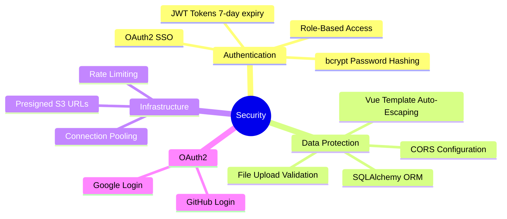

# CityPulse Security

## Current Security Measures



### Authentication

| Measure | Implementation |
|---------|---------------|
| Password Hashing | bcrypt via passlib (adaptive hashing) |
| JWT Tokens | 7-day expiry, signed with secret key |
| Token Storage | localStorage (frontend) |
| Token Transmission | `Authorization: Bearer` header |
| Role-Based Access | `citizen` and `admin` roles |

### Data Protection

| Measure | Implementation |
|---------|---------------|
| SQL Injection Prevention | SQLAlchemy ORM (parameterized queries) |
| XSS Prevention | Vue template auto-escaping |
| CORS | Configured via flask-cors |
| File Upload Validation | Size limits, type checking |
| Presigned URLs | Time-limited S3 access (7-day expiry) |

---

## Known Vulnerabilities

### Critical

| Issue | Risk | Location | Fix |
|-------|------|----------|-----|
| S3 credentials hardcoded | High | `config.py:20-21` | Move to env vars |

### High

| Issue | Risk | Location | Fix |
|-------|------|----------|-----|
| CORS allows all origins | High | `app.py:40-41` | Restrict to production domain |
| No rate limiting | High | All endpoints | Add Flask-Limiter |
| No CSRF protection | Medium | State-changing endpoints | Add CSRF tokens |
| JWT in localStorage | Medium | Frontend | Consider httpOnly cookies |

### Medium

| Issue | Risk | Location | Fix |
|-------|------|----------|-----|
| No input sanitization | Medium | All form inputs | Add bleach/sanitize |
| Debug mode in production | Medium | `app.py:170` | Disable in production |
| No request size limits | Medium | File uploads | Configure nginx |

### Low

| Issue | Risk | Location | Fix |
|-------|------|----------|-----|
| No security headers | Low | All responses | Add flask-talisman |
| No API versioning | Low | All endpoints | Add version prefix |
| No audit logging | Low | Admin actions | Add audit trail |

---

## Security Recommendations

### Immediate (Before Production)

1. **Move all secrets to environment variables**

   ```python
   S3_ACCESS_KEY = os.environ.get("S3_ACCESS_KEY")
   S3_SECRET_KEY = os.environ.get("S3_SECRET_KEY")
   ```

2. **Restrict CORS**

   ```python
   CORS(app, origins=["https://your-domain.com"])
   ```

3. **Disable debug mode**

   ```python
   app.run(debug=os.environ.get("FLASK_ENV") != "production")
   ```

4. **Add rate limiting**

   ```python
   from flask_limiter import Limiter
   limiter = Limiter(app, default_limits=["200 per day", "50 per hour"])
   ```

### Short-Term (First Month)

1. Add security headers (flask-talisman)
2. Implement CSRF protection
3. Add request logging
4. Set up database backups
5. Add input validation/sanitization

### Long-Term (Ongoing)

1. Regular dependency updates (`pip-audit`, `npm audit`)
2. Penetration testing
3. Security audit of S3 bucket policies
4. Monitor for suspicious activity
5. Implement account lockout after failed attempts

---

## File Upload Security

| Check | Implementation |
|-------|---------------|
| Max file size | 15MB per file |
| Max files | 10 images per report |
| File types | Images, audio, video (server-side validation) |
| Storage | S3 with presigned URLs |
| Processing | Image compression to WEBP before storage |

**Recommendations:**

- Validate file MIME types (not just extensions)
- Scan uploads for malware (ClamAV)
- Use S3 bucket policies to restrict access
- Set shorter presigned URL expiry for production

---

## JWT Security

| Aspect | Current | Recommendation |
|--------|---------|----------------|
| Expiry | 7 days | Keep for UX, consider refresh tokens |
| Storage | localStorage | Consider httpOnly cookies |
| Secret | Hardcoded fallback | Use strong, random secret |
| Algorithm | HS256 (default) | Acceptable for this use case |
| Claims | user_id, role | Add token version for revocation |

**Token Revocation:** Currently no way to revoke tokens before expiry. Consider:

- Token blacklist (Redis)
- Token versioning in database
- Short-lived access + long-lived refresh tokens

---

## API Security Checklist

- [x] Passwords hashed with bcrypt
- [x] JWT tokens for authentication
- [x] Role-based access control
- [x] SQL injection prevention (ORM)
- [x] File size limits
- [x] Presigned S3 URLs
- [ ] Rate limiting
- [ ] CSRF protection
- [ ] Input sanitization
- [ ] Security headers
- [ ] Request logging
- [ ] Account lockout
- [ ] API key management
- [ ] CORS restriction
- [ ] HTTPS enforcement
